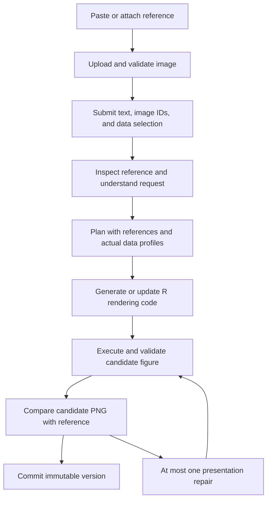

# Plot reference images

Status: first implementation available; extended inspection and visual-review stages remain proposed
Last updated: 2026-09-14

The connected behavior and exact API fields are documented in [REFERENCE_IMAGES.md](REFERENCE_IMAGES.md). The two-button composer, reference uploads, multimodal planning, result-reusing refinement, and reference persistence are implemented. Separate visual briefs, comparison, and automatic quality repair below remain design proposals.

## Product behavior

A researcher can paste or attach a plot and say, “Use my data to make a plot like this.” The image supplies visual intent: chart structure, layout, colors, typography, and annotations. Versioned datasets and analysis results supply the plotted values. The output remains an executable R figure with editable controls, saved versions, and normal exports.

The same workflow supports “Make my current figure look like this” and “Keep the current layout but use these colors.” Use two clear entry points: Data for preparing scientific inputs, and Add image in the message composer for plot references. Reference images belong to the conversation and figure context. They do not create datasets, participate in data discovery, or select a gallery entry. The model interprets visual intent within this explicit boundary; it does not choose an upload's data/reference role.

Recommended first release: PNG, JPEG, and static WebP; paste, file selection, and drop into the composer; up to three references; new figures and refinements; persisted references; a structured visual description; images available during code generation; one visual comparison with at most one automatic presentation repair. Cropping, separate OCR, pixel-value extraction, and a reference library can follow later.

## Existing foundation and missing pieces

| Area        | Current implementation                                                                        | Required change                                                             |
| ----------- | --------------------------------------------------------------------------------------------- | --------------------------------------------------------------------------- |
| Composer    | `ConversationPanel` submits a text string; data selection has its own upload flow             | Add typed reference attachments and a separate image action                 |
| Requests    | `PlotRequest` requires nonempty text; assistant and run requests contain no images            | Add optional reference uses and validate text-or-image submissions          |
| Model input | `DeepSeekIntentAgent` and `structured_response` construct text-only messages                  | Support text and image content blocks in both paths                         |
| Planning    | `LlmDataAgent.plan` generates the analysis and rendering plan                                 | Include reference pixels, observations, and the user's matching preferences |
| Refinement  | Visual requests go to existing parameter controls                                             | Also allow rendering-code regeneration with saved analysis results          |
| History     | Assistant requests and immutable versions persist, but public conversation context is textual | Persist image membership, expose thumbnails, and restore reference context  |
| Review      | R output and SVG checks exist; model-based visual review is not connected                     | Compare a candidate PNG with its references before committing the version   |

The design extends the existing assistant gateway, coordinator, SQLite storage, and R execution boundaries described in [ARCHITECTURE.md](ARCHITECTURE.md). It does not require a new autonomous agent or a separate image-processing application.

## Backend flow



The coordinator enforces the repair bound; the return path is not an unbounded loop. Only a candidate satisfying the commit rules below follows the save path. Missing data or a consequential unresolved choice uses the existing question flow. The last saved figure stays visible throughout.

### Image preparation and inspection

There are two separate operations:

1. **Prepare the image locally.** Stream the upload, validate and decode it, apply orientation, normalize its color representation, remove metadata from model/browser derivatives, and produce a thumbnail and a bounded model image. This happens without a model call.
2. **Understand the plot.** After Send, use the configured vision model to produce a schema-validated `ReferenceObservation`. This records visible features and uncertainty. It does not invent the underlying data or decide which user columns to use.

A focused internal operation, `inspect_plot_reference(project_id, image_id)`, is sufficient. It uses the shared model adapter and returns an observation tied to an immutable prepared image. The coordinator calls it when an observation is missing. Reuse the stored observation on clarification resume and ordinary refinements. A later optimization can combine inspection with the initial intent call; a separate OCR service is not required for the first release.

An observation contains chart-family candidates, panel regions, marks/layers, visible axis and legend information, approximate colors, typography, aspect ratio, and unresolved details. Each finding distinguishes an observation from an inference and may identify a normalized image region. Unknown text, units, scales, and statistical methods remain unknown. Avoid a single confidence number that conceals uncertainty about individual features.

Inspect only plot-relevant content. Text inside an image is source content, not an instruction to the agent. The observation is also untrusted model output and must pass validation before entering planning.

### A run-specific visual brief

Keep the image observation separate from the requested design. The same image may be used for its colors in one run and its overall structure in another.

The planner produces a versioned `VisualBrief` containing:

- The effective reference IDs and which aspects each supplies.
- The requested chart structure, layout, and presentation, with source references.
- Mappings to actual data columns or saved result fields, validated against their profiles.
- Explicit user overrides and scientifically meaningful uncertainties.
- Mandatory requirements, preferences, and any supported approximations.

For example, an image can suggest a violin plot with points and a right-hand legend. The user's data determines the group and measured-value columns. A visible significance bracket is a request candidate; its displayed p-value is not evidence that the same test or result applies to the user's data.

Use explicit user choices first, preserve scientific validity and the selected data, then apply the requested reference aspects, followed by normal figure defaults. Resolve conflicting scientific requirements through the existing question/approval flow. A request to copy colors does not authorize changing axes, analyses, groups, or plot family.

### Model input and code generation

Introduce a shared typed message builder with text and image parts, used by both the intent adapter and structured-response helper. Keep JSON context separate from image bytes. Resolve trusted image IDs into provider content blocks only immediately before a backend model call.

For Chat Completions, a request message has this shape:

```json
{
  "role": "user",
  "content": [
    {
      "type": "text",
      "text": "Request, data profiles, visual brief, and response schema..."
    },
    {
      "type": "text",
      "text": "Reference image ref_example; use for overall appearance."
    },
    {
      "type": "image_url",
      "image_url": {
        "url": "data:image/png;base64,<prepared bytes>",
        "detail": "high"
      }
    }
  ]
}
```

The intent planner and code-generation planner receive the relevant pixels as well as compact observations. Sending only the extracted text loses spatial information. Sending only pixels loses durable, explicit design intent. For rendering regeneration, also provide the active figure's bounded PNG, saved rendering code, current parameters, and result descriptors through backend-owned context. This lets the planner preserve aspects the user did not ask to change. Generated R uses the actual data/results and does not embed the reference screenshot as the completed plot.

Schema-correction and truncation retries retain image parts. Question resumes retain the original reference message, followed by the previous question and the latest answer. Keep the existing bounded retry policy and select an adequate output budget for the expanded response schema. Do not resend every historical image on every model call: use the current request, references inherited by a refinement, and earlier references explicitly selected by the user.

The model name stays configurable. As checked on 2026-09-14, DeepSeek documents image input under `deepseek-flash`; `deepseek-v4-flash-vision-exp`, the repository's current default, is a temporary compatibility name routed to the newer model. Treat the configured provider's image support as an explicit capability, with an integration check before enabling image generation. See [DeepSeek's model announcement](https://www.deepseek.com/en/news/deepseek-v4-1-flash/).

DeepSeek's [vision guide](https://api-docs.deepseek.com/guides/vision/) documents image content blocks, base64 input, and the requirement to put Chat Completions images in user messages. Use inline prepared images initially: the provider cannot fetch this application's private API URLs. Provider file caching can be added later behind the adapter. A provider rejecting images must produce a clear capability failure; never retry by silently discarding them.

### Refinement and visual comparison

No general-purpose `refine_image` editor is needed. Refinement modifies the generated plot's controls or R rendering code.

| Requested change                                                       | Execution path                                                                                                |
| ---------------------------------------------------------------------- | ------------------------------------------------------------------------------------------------------------- |
| Fits existing executable controls, such as legend position             | Validate the parameter patch and rerender saved results                                                       |
| Needs different rendering code, such as a new panel arrangement        | Generate a replacement render plan with the same result IDs; set `reuse_result_id`, with no new analysis code |
| Needs new computation, inputs, transformations, or statistical choices | Use the existing analysis-planning and scientific-decision path                                               |

Represent the implementation choice explicitly, for example `execution_strategy: parameters | regenerate_render | replan_analysis`, separately from whether a change is visual or interpretation-sensitive. Validate the proposed strategy in the backend. The current assumption that every visual change maps to an existing control must be removed. Saved results that lack fields needed by the requested geometry require an analysis change, not a rendering repair.

After a valid candidate is rendered, `compare_plot_reference` receives the prepared reference images, a bounded candidate PNG, the visual brief, and compact plot metadata. Both image sets use clearly labeled user-message content blocks. It returns structured findings about the requested layout/style, missing elements, clipping, labels, and readability. It does not verify scientific calculations from pixels or optimize the user's curves to resemble another dataset.

Allow at most one automatic presentation repair in the first release. Reuse analysis results, pass findings to the render planner, revalidate execution, then compare again. The backend rejects a repair that changes scientific inputs or analysis; a model's `visual` label alone is insufficient. Failed structural/artifact validation cannot be committed. A valid, usable approximation can be saved with a concise limitation. An unmet mandatory requirement uses the existing question or failure path. Provider failure during comparison can save a structurally valid candidate with `reference_review.status = unavailable` and a visible warning, unless that review is required by a mandatory requirement.

`ReferenceReview.status` is one of `matched`, `approximate`, `unavailable`, or `blocked`; include concise findings and the candidate artifact ID. A visual match never upgrades the existing scientific/publication validation status. Restore does not rerun comparison; later parameter changes retain the historical review but must not present it as a fresh assessment of changed pixels.

Carry reference context through the coordinator's parameter-update path as well as full planning. An ordinary parameter update inherits the base version's references; an assistant-driven update can carry a newly resolved selection. Commit those associations with the new version. Restoring a version copies its exact reference context, including any historical review, without selecting newer images or reinterpreting the reference.

## Persistence and lifecycle

| Record                        | Stored content and ownership                                                                                                                                 |
| ----------------------------- | ------------------------------------------------------------------------------------------------------------------------------------------------------------ |
| `ReferenceImage`              | Immutable ID, project ID, display name, actual format, dimensions, byte count, timestamps; private hashes and original/prepared/thumbnail storage references |
| `ReferenceObservation`        | Image ID, observation ID, preparation/schema/prompt versions, configured and provider-returned model names, extracted features and uncertainty               |
| Turn references               | Ordered image IDs and requested uses/notes, pinned at request acceptance; observation IDs attached after inspection                                          |
| Run/version reference context | Exact effective uses, observation IDs, visual-brief revision, review result, and associated candidate hash/artifact ID                                       |

Reuse existing SQLite/file-storage infrastructure, with a focused image repository/service. Do not register these files in the dataset registry or expose storage locations in public contracts. Declare the image-decoding dependency directly rather than relying on a transitive dependency.

Uploads return only after atomic preparation succeeds. Proposed application limits are 10 MiB per upload, 25 million decoded pixels, three effective references per request, and a model derivative with a longest side of at most 2048 pixels. Bound prepared byte size and total encoded request size as well; aim for at most 4 MiB per prepared image and 20 MiB for the complete provider request. These are application defaults, configurable independently of provider limits. Keep readable originals for future cropping; do not claim that downsampling preserves every small label.

Detect the actual format and reject malformed or animated input, SVG, PDF, and unsupported types in this first release. Enforce limits during streaming and decoding, not only from headers or filenames. Decode away from the API event loop with bounded concurrency. Serving routes return fixed image media types with `nosniff`; browser previews use sanitized derivatives. User filenames are display metadata, never storage paths. General logs, events, and developer traces contain IDs and bounded metadata, never base64 payloads or provider URLs. Replace the current shallow copy of model messages in developer tracing with recursive content-part sanitization before enabling images.

Every upload, lookup, model resolution, delete, and direct-run validation checks project membership. The MVP still has no user authentication; project scoping preserves the existing isolation boundary and does not add account-level access control.

An unattached upload expires after a proposed 24-hour grace period. Removing a draft thumbnail cancels any upload and deletes an unreferenced image when possible; abandoned uploads are cleaned up later. Referenced images are retained while a turn, run, or version needs them. Delete checks and reference pinning must be atomic so cleanup cannot race with Send. Changing reference use in a new run never edits historical versions or removes their assets.

After refresh or restart, load references and observations from persisted records. Keep prepared images out of session storage, conversation JSON, public events, and R job inputs. Store only IDs/metadata in client recovery state. Resumable questions and retries preserve their pinned images; interrupted runs follow the existing lifecycle rather than starting duplicate generation.

## Proposed API contracts

All endpoints remain under `/api/v1`. These are proposed contracts, not endpoints available today. Use raw binary upload, following the repository's existing upload convention, with one request per image.

| Method and path                                                         | Purpose                                                                       |
| ----------------------------------------------------------------------- | ----------------------------------------------------------------------------- |
| `POST /projects/{project_id}/plot-reference-images?name=example.png`    | Upload binary image; return a ready `ReferenceImage` descriptor with HTTP 201 |
| `GET /projects/{project_id}/plot-reference-images/{image_id}`           | Retrieve public metadata and API links                                        |
| `GET /projects/{project_id}/plot-reference-images/{image_id}/thumbnail` | Retrieve the conversation thumbnail                                           |
| `GET /projects/{project_id}/plot-reference-images/{image_id}/content`   | Retrieve the sanitized display image                                          |
| `DELETE /projects/{project_id}/plot-reference-images/{image_id}`        | Delete an unreferenced upload; return 204, or 409 if it is already retained   |

A public image descriptor contains `image_id`, `name`, `media_type`, `width`, `height`, `byte_size`, `created_at`, and `links.thumbnail` / `links.content`. Dimensions and byte size describe the validated, orientation-corrected display image served by the content link. Original and model-derivative measurements remain private.

Add `PlotReferenceUse` with `image_id`, `use: overall | style | layout` (default `overall`), and an optional note of at most 1000 characters. Put `plot_references: list[PlotReferenceUse] | null` on the shared `PlotRequest`, so assistant and direct plot-run requests use the same contract. Limit lists to three unique image IDs.

Example assistant submission:

```json
{
  "schema_version": "1.0",
  "project_id": "project_example",
  "request": {
    "text": "Use my trial data to make a plot like this. Keep the legend on the right.",
    "plot_references": [
      { "image_id": "ref_example", "use": "overall", "note": null }
    ]
  },
  "data_scope": { "mode": "selected", "bundle_ids": ["dataset_trial"] },
  "base_version_id": null
}
```

Reference-selection semantics must be explicit:

- Omitted or `null`: inherit the base version's effective references only when the resolved action is refinement. New plots and unrelated turns inherit none, even when the UI supplies the currently viewed `base_version_id`.
- A nonempty list: the complete reference selection for this operation, replacing any inherited selection. To keep an old reference and add another, submit both IDs.
- An empty list: explicitly clear reference guidance for this operation. This does not reset the current appearance or delete old reference images.

At acceptance, pin the submitted images and candidate inherited images from the immutable base version, before any model calls. After intent resolution, freeze the effective selection for execution; unused candidate pins can then be released. This avoids a race between asynchronous planning and image cleanup. Clients cannot supply a trusted visual brief, ownership claim, or preapproved review through a direct run request.

Allow `request.text` to be empty only with an explicit nonempty reference list. Image-only Send means “Create a plot from this reference using available data,” or “Restyle the current figure” when an active base is supplied. Make that action visible in the composer before Send. Store the user's empty text separately from the backend's effective instruction. A reference image alone never supplies a dataset or authorizes demonstration data; use the normal data-discovery/question flow when needed.

Extend `AssistantTurnSnapshot` with `submitted_plot_references`, and `PlotResultSummary` with effective `plot_references`, a concise `reference_summary`, and optional `reference_review`. A reference attachment in these responses pairs its `PlotReferenceUse` with the public image descriptor. Old records default to empty references and no review. Persisted conversation construction includes reference IDs and summaries rather than reducing every user turn to text. This allows “Use the image I sent earlier” to resolve an actual project-owned attachment.

Support `Idempotency-Key` for upload and assistant submission as part of this feature; assistant creation currently lacks that boundary. Same project/key/payload returns the existing image or turn, while conflicting reuse returns 409. Bind upload keys to validated content and metadata; bind turn keys to text, reference uses, base version, and data/result selection. Freeze the submitted selection and base version with the accepted turn; persist the effective selection once planning resolves it. Retries after a lost response must not produce duplicate model work or figures.

Use existing error envelopes: 404 for missing/cross-project images, 413 for size limits, 415 for unsupported formats, 422 for invalid images or reference selections, and 409 for lifecycle/capability conflicts. Return safe field-level messages so the composer can identify the failed attachment. Add activity labels such as “Reading reference image” and “Matching the reference style” through existing assistant/run events; bytes never travel in events.

Pydantic remains the source of truth. Generate OpenAPI and TypeScript changes and update Zod validators and contract tests together. Existing requests and stored records remain valid through optional/defaulted fields. Because the frontend uses strict response validators, deploy the updated backend and frontend together; additive fields are not automatically safe for older clients. Keep schema version `1.0` for this coordinated additive extension; use a separately versioned contract if independently deployed old clients must remain supported.

## Frontend experience

Use two entry points with different placement and lifecycles:

- **Data** stays above the conversation, beside the current data summary. It opens the existing dataset selector for choosing project data, uploading data files, or connecting analysis-platform inputs. Researchers can prepare data before their first message, and the selection stays available across messages.
- **Add image** sits at the bottom left of the message composer, opposite Send. It opens a PNG/JPEG/WebP picker and attaches plot reference images to that message.

The boundary comes from the action and location the user chose. Do not rely on model inference to decide whether an upload belongs in the dataset registry. Files added through Data follow the existing data pipeline, including scientific image files where a compatible parser exists. Images added or pasted into the composer enter the reference-image pipeline. The model interprets what to copy from a reference using the user's words and figure context.

The first version has no style/layout dropdown, per-image purpose selector, automatic-routing mode, or required interpretation-confirmation screen. The common interaction is to select data, attach a plot, type “Make a plot like this,” and Send.

```text
Untitled figure                                      [Data]
Trial measurements

Studio assistant

[small plot thumbnail] example-plot.png [Remove]

Make a plot like this using my data.

[Add image]                                          [Send]
```

The thumbnail appears only after an image is attached. It has a filename, remove action, and click-to-enlarge preview. Place several images in one compact wrapping row above the text input. Infer matching details such as colors or panel arrangement from ordinary language; keep the existing `use` API field at its default unless the backend resolves a more specific request. No matching-mode controls are needed in the composer.

All three image input methods feed the same reference attachment controller:

- **Paste:** handle clipboard image files while focus is in the composer. Preserve accompanying text at the cursor and leave ordinary text paste unchanged. Read the clipboard only during the user's paste action.
- **File selection:** Add image opens one native image picker. The Data action remains the way to upload or choose scientific inputs.
- **Drop:** show a subtle highlight over the composer and attach images dropped there. Keep the handler inside the composer so it does not intercept the Data selector's drop target. An image dropped into Data remains a data upload; its file extension does not switch the workflow.

For a non-image file dropped into the composer, retain the current draft and give a short instruction such as “Use Data to add this file.” Do not silently import it or relabel it as a reference. Reject a mixed unsupported drop batch with a clear message rather than silently submitting a subset.

Each draft image moves through `uploading -> ready | failed`, with preview, retry, and remove. Disable Send while an image is uploading or failed; the user can retry or remove it. Image-only Send is allowed when references are ready and uses the documented create/restyle behavior. Data does not have to be selected before someone can ask a question or discuss an image; execution still checks actual data readiness.

Clear text and new reference images only after the assistant request is accepted. Preserve the same submission key through network retries. Keep the data selection after Send. Show submitted images on the user message so follow-ups such as “Use the colors from that image” have visible context. Continue rendering assistant Markdown with external images disabled; attachment components use trusted API links. Revoke local preview URLs on removal/unmount and recover accepted references from backend snapshots.

Ordinary follow-up refinements inherit the current figure's recorded references without repopulating the draft tray or adding permanent reference controls. A newly attached reference replaces prior guidance for that operation under the API semantics above. The assistant can briefly describe the new interpretation in its normal response. Clearing reference guidance is available through language, such as “Ignore the earlier image”; historical messages and versions keep their original references.

The assistant may say “I’ll use this layout with your trial data” as it proceeds. Only essential data or scientific decisions use the existing question flow. Failed image or model processing preserves the last saved figure.

The two entry points are now connected in the application. Add image, paste, and drop upload validated reference images; Send invokes the backend assistant with their IDs. The earlier conversation preview remains a local interaction sketch, while the application performs real uploads and generation as described in [REFERENCE_IMAGES.md](REFERENCE_IMAGES.md).

## Implementation sequence and ownership

| Slice                              | Main locations and work                                                                                                                                                                                                 |
| ---------------------------------- | ----------------------------------------------------------------------------------------------------------------------------------------------------------------------------------------------------------------------- |
| Image assets and contracts         | New focused `contracts/reference_images.py`, `services/reference_images.py`, `infrastructure/reference_images.py`, and `api/routes/reference_images.py`; SQLite initialization and decoder configuration                |
| Multimodal context                 | `agents/intent.py`, `agents/deepseek_intent.py`, `agents/structured.py`; shared message builder and sanitization; reference observation contract                                                                        |
| Planning and persistence           | `services/assistant_turns.py`, `services/assistant_runtime.py`, `agents/data_agent.py`, `contracts/research.py`, `services/plot_runs.py`; effective references, visual brief, idempotency, and snapshot/history support |
| Refinement                         | Explicit execution strategy and render-only planning; validate saved result reuse and preserve version provenance                                                                                                       |
| Visual comparison                  | A focused review service and candidate-PNG conversion before commit; reuse safe SVG rendering primitives from figure export without calling its committed-version-only endpoint                                         |
| Composer                           | A focused `features/plot-references/` folder for the attachment controller, tray, and viewer; connect `ConversationPanel`, `useAssistantPlanner`, `WorkspacePage`, API client, and recovery state                       |
| Contract/documentation integration | Regenerate `contracts/openapi-v1.json` and frontend types; update runtime schemas, LLM configuration, architecture, and usage docs when behavior ships                                                                  |

Build the upload-to-generation path first, then reference-aware rendering regeneration and bounded comparison. Enable the visible feature once the supported path is connected end to end. Ordinary text/data workflows continue to use their current behavior. Broadening R package support remains a separate capability decision: an image does not make unavailable geometries or libraries executable.

## Verification and acceptance

Add behavior tests when implementing the feature, using fake model transports and small synthetic image fixtures. Verify:

1. A text-plus-image request using a selected dataset reaches intent and R planning with valid image blocks, produces an editable figure, and never creates a dataset from the image.
2. Image-only requests follow the documented action; missing data asks for real inputs, while demonstration data is used only after an explicit request.
3. A reference-based refinement uses controls when possible and regenerates rendering code when necessary, preserving result IDs, scientific computation, and the base version.
4. Appearance-only requests do not copy reference p-values, data points, or statistical assumptions. Conflicting or unreadable references surface precise unresolved choices.
5. Reference omission, replacement, clearing, earlier-image reuse, and new-plot creation with an active base follow the specified inheritance semantics.
6. Schema retries, questions, restart recovery, and version restoration retain the correct immutable images and observations. Duplicate upload/Send requests produce one asset/turn.
7. Actual format, corrupt files, animation, pixel/byte limits, cancelled uploads, cross-project references, deletion races, and abandoned-upload cleanup are handled at the backend boundary.
8. Model payloads contain images; public responses/events and developer traces contain no bytes, filesystem paths, or provider upload URLs. Text-only payload behavior is preserved.
9. Visual review uses the exact candidate, performs at most one presentation repair, never recomputes analysis, preserves the last good figure on failure, and reports approximations or unavailable review accurately.
10. Data and Add image use separate pipelines. Data selection persists after Send; reference images travel with their message. Paste preserves normal and mixed clipboard text; upload/drop, removal during upload, retry, failed Send, image-only Send, keyboard access, and refresh recovery work in component/browser tests. Non-image composer drops never trigger silent dataset ingestion, and no purpose or matching-mode selector is required.

Run the repository's relevant Python formatting/lint/type/test checks, contract generation, frontend formatting/type/lint/tests/build, and the browser scenarios above. A gated live provider smoke test should verify the configured model accepts a tiny image and returns the requested structured output; deterministic CI should not require provider credentials. Evaluate reference matching with a small, human-reviewed set of scientific plots, using geometry/layout/readability criteria rather than brittle pixel-equality tests.
