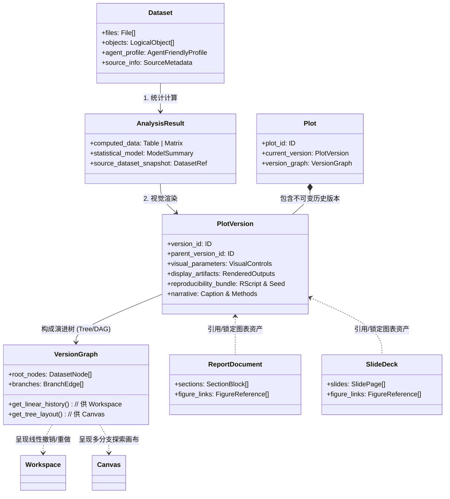

# Vis Platform 后端核心概念数据模型（Conceptual Data Model）

> **定位**：本文件是汇报的技术附录，对应 slides.html 第 5 页「数据内核」，供技术评审深入阅读；汇报主线的完整文稿见 [SLIDES_DECK_ZH.md](SLIDES_DECK_ZH.md)。
>
> **设计目标**：剥离底层数据库细节，从**面向对象与科研认知**的视角，解析后端的核心领域模型。  
> 阐明数据如何被 Agent 理解、图表如何被 UI 呈现、探索历史如何构成图谱，以及图表如何作为资产嵌入学术报告与幻灯片中。

---

## 一、 核心概念全景图（The Big Picture）

整个平台由五大核心概念对象驱动，形成从“原始数据 ➔ 智能理解 ➔ 统计计算 ➔ 视觉呈现 ➔ 叙事消费”的清晰链路：

1. **整体平台工作流划分（上游探索工坊 vs 下游叙事聚合）**：


2. **核心概念对象模型（面向对象与认知模型）**：




---

## 二、 核心类与属性设计（Core Conceptual Classes）

### 1. `Dataset` 类：数据源与 Agent 认知名片
在科研场景中，科研人员上传的数据往往很大（甚至几个 G），AI 模型不可能直接去读整个原始数据。因此 `Dataset` 对象不仅管理物理文件，更重要的是提取出**对 Agent 友好的认知名片**。

- **核心属性**：
  - **`files`（物理文件集合）**：包含的一组原始文件（如表达谱 `counts.csv`、样本临床信息 `metadata.tsv`）。
  - **`objects`（逻辑数据结构）**：将文件映射为科研中理解的逻辑对象（如表达矩阵、样本元数据表、基因注释表）。
  - **`agent_profile`（⭐ Agent 友好型数据画像）**：
    - **列名与语义类型**：明确每一列是“类别变量”、“连续数值”、“时间”还是“结局”。
    - **观测单元（Observation Unit）**：告诉 Agent 一行数据代表的是“一位病人”、“一个细胞”还是“一个时间点”。
    - **精简统计特征**：各列极值、常见分组类别、缺失率（Missing Values）。
    - *设计价值*：Agent 仅凭几十行精简画像就能做出精准的科研推理，既不消耗海量 Token，又杜绝原始敏感数据泄露。

---

### 2. `AnalysisResult` 类：解耦的统计计算中间态
许多通用工具之所以慢，是因为改个标题就要把所有统计从头算一遍。Vis Platform 在数据与图表之间，抽象出了独立的 `AnalysisResult` 对象。

- **核心属性**：
  - **`computed_data`**：重度统计计算的产物（例如生存分析拟合后的生存率与置信区间曲线坐标表、差异表达分析算出的 LogFC 与 $p$ 值）。
  - **`statistical_model`**：统计检验模型参数（使用的统计检验类型、自由度、拟合优度）。
  - **`source_dataset_snapshot`**：绑定产生该结果的原始数据指纹。
- **设计价值**：
  - **计算与视觉解耦**：如果科研人员只是调颜色、改尺寸、调整图例，系统直接复用这个结果，**零重算、毫秒级响应**；只有更换统计假设或分组条件时，才重新生成 `AnalysisResult`。

---

### 3. `Plot` 与 `PlotVersion` 类：UI 渲染与论文发表的最终载体
`Plot` 代表图表的逻辑生命体，而每一次调整生成的 `PlotVersion` 则是**绝对不可变（Immutable）**的快照。

- **核心属性（面向 UI 展示与论文发表）**：
  - **`visual_parameters`（UI 控件与参数配置）**：
    - 前端右侧面板可以直接绑定的参数对象：图表主尺寸（宽度/高度）、期刊预设配色（Nature / Science 调色板）、字体族、显著性标记格式。
  - **`display_artifacts`（多格式渲染产物）**：
    - **交互级 SVG**：给前端 UI 主画布渲染，支持局部缩放、选区查看；
    - **出版级 300 DPI PNG**：用于快速预览与视觉审核；
    - **矢量 PDF**：科研人员可直接下载投稿的高清矢量版。
  - **`reproducibility_bundle`（可复现性数据包）**：
    - 记录本次画图由系统生成的**纯净 R 脚本代码**、固定随机数种子、使用的 R 包依赖版本。科研人员随时可导出在本地 RStudio 中完全重现。
  - **`narrative`（伴生学术文本）**：
    - AI 生成的图题说明（Figure Caption）与统计方法简述（Methods Summary），供科研人员直接复制到论文正文。

---

## 三、 工作区与探索画布的数据结构：`VersionGraph`

科研探索不是一条笔直的流水线，而是充满“假设对比与反复试错”。后端用 **版本有向树/图（Version DAG）** 来支撑界面的时间穿梭与发散探索：

```mermaid
graph LR
    D[Dataset: 肺癌临床队列] --> P1_V1[Plot 1: 总生存曲线 (初稿)]
    P1_V1 -->|修改颜色与尺寸| P1_V2[Plot 1: 总生存曲线 (精修版)]
    
    D -->|发散分支| P2_V1[Plot 2: 基因表达箱线图]
    P2_V1 -->|细化分群| P2_V2[Plot 2: 分群小提琴图]

    subgraph Workspace 视角: 沿着单条分支线性穿梭
        P1_V1 -.-> P1_V2
    end

    subgraph Canvas 视角: 二维平面展现全部分支树
        D -.-> P1_V1
        D -.-> P2_V1
    end
```

### 1. 数据结构：版本树节点与父指针
每个 `PlotVersion` 都包含一个 `parent_version_id` 指向上一版本：
- **`PlotVersion A`**（根节点，初稿）
- **`PlotVersion B`**（`parent: A`，调整了配色）
- **`PlotVersion C`**（`parent: A`，从 A 衍生出的另一个平行探索分支）

### 2. 两个界面的针对性消费：
- **Workspace（单图深度打磨）**：
  - 将当前图表的版本链解析为**线性历史（Linear Timeline）**。
  - 用户像使用 Git 或文档历史一样，支持一键“撤销（Undo）”、“重做（Redo）”或“还原历史参数”。
- **Canvas（无限分支画布）**：
  - 将整个 `VersionGraph` 的父子关系解析为**二维节点图谱（Node-Graph Layout）**。
  - 用户可以直观看到同一份数据如何衍生出两条不同结论的图表分支，点击任意节点即可展开独立微调，各分支互不影响。

---

## 四、 报告与幻灯片的内容数据结构：`Document Tree & Figure Link`

当图表走出探索阶段，需要组织成论文（Report）或汇报（Slides）时，后端采用了**结构化内容块树（Content Block Tree）**配合**图表资产指针（Figure Reference Link）**。

```mermaid
graph TD
    subgraph Report 数据结构: 结构化文档树
        R[Report Document] --> S1[Section: 背景]
        R --> S2[Section: 结果与分析]
        S2 --> P1[Text Block: 正文文字描述...]
        S2 --> FB[Figure Block: 嵌入图表引用]
    end

    subgraph Slides 数据结构: 幻灯片序列容器
        Deck[Slide Deck] --> Slide1[Slide 1: 封面]
        Deck --> Slide2[Slide 2: 核心发现]
        Slide2 --> TextSlot[Layout: 结论摘要文字]
        Slide2 --> FigSlot[Layout: 图表卡槽引用]
    end

    subgraph 后端图表资产库 (Plot Versions)
        TargetPlot[PlotVersion: 最终定稿图]
    end

    FB -->|Figure Link: 链接引用| TargetPlot
    FigSlot -->|Figure Link: 链接引用| TargetPlot
```

### 1. 内容结构：块状容器模型（Block-based Tree）
- **Report 结构**：
  `Document ➔ Sections ➔ Subsections ➔ [Text Blocks, Table Blocks, Figure Blocks]`
- **Slides 结构**：
  `Deck ➔ Slides (16:9 页面) ➔ Layout Slots ➔ [Title Slot, Bullet Points, Figure Slot]`

### 2. 核心机制：图表资产引用指针（Figure Link）
报告和幻灯片中的图表**绝不是静态死图**，而是一个配置指针对象：
```typescript
interface FigureReferenceLink {
  plot_id: string;              // 关联的逻辑图表
  pinned_version_id?: string;   // 若指定，则锁定在该版本（即使源图改了也不变）
  follow_latest: boolean;       // 若为 true，自动联动展示该图在 Workspace 的最新修改
  custom_caption?: string;      // 该报告上下文特有的图注补充
  layout_width: "full" | "half" | "third";
}
```

- **模式 1：动态联动（Follow Latest）**
  在初期写作时，源图可能还在 Workspace 微调。此时报告里的图自动跟随最新版，省去反复重新截图替换的繁琐手工。
- **模式 2：版本锁定（Pinned Version）**
  当论文某个章节已审定或结题，科研人员可将该图“锁定在 v2 版本”。之后即便在 Canvas 或 Workspace 里继续做新的探索，也不会破坏已成文的学术报告。

---

## 五、 总结：概念模型带来的核心价值

| 核心概念模型 | 对应的业务痛点 | 达成的科研体验 |
| :--- | :--- | :--- |
| **`Dataset (Agent-friendly Profile)`** | 原始数据过大、模型读不懂或数据泄露 | Agent 瞬间抓住关键列与科研含义，精准生成合适图表 |
| **`AnalysisResult (计算解耦)`** | 调个颜色字体就要全量重跑耗时统计 | 纯视觉修改秒级响应，保留计算结果多次复用 |
| **`PlotVersion (不可变产物)`** | 论文发表要求代码可复现、版本混乱 | 每次改图沉淀代码快照与 300 DPI 矢量源文件 |
| **`VersionGraph (分支图谱)`** | 科研假设对比繁琐，缺少回退与探索路径 | Workspace 专注单图撤销还原，Canvas 直观对比多分支假设 |
| **`Figure Link (资产引用模型)`** | 传统 Word/PPT 插入静态图，一改全崩 | 报告与幻灯片既能实时同步图表最新进展，又能一键锁定防扰动 |
